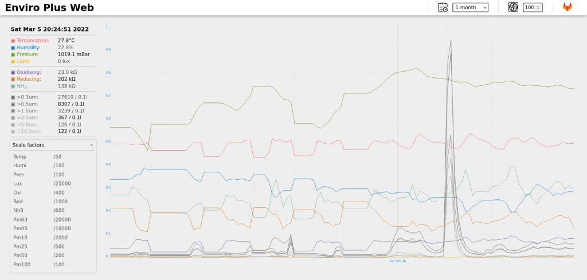

# 🌿 Enviro Plus Web

Web interface for [Enviro](https://shop.pimoroni.com/products/enviro?variant=31155658489939) and [Enviro+](https://shop.pimoroni.com/products/enviro?variant=31155658457171) sensor board plugged into a Raspberry Pi.



A very simple Flask application that serves a web page with the current sensor readings and a graph over a specified time period.

Forked from <https://github.com/nophead/EnviroPlusWeb>

## 📖 User guide

### Install

To use the Enviro board, you’ll need to install its Python library. Open a Terminal window and enter the following commands:

```
git clone https://github.com/pimoroni/enviroplus-python

cd enviroplus-python

sudo ./install.sh

sudo pip install smbus2
```

Once that’s all done, enter `sudo reboot` to restart your Raspberry Pi to apply the changes.  
The install script enables I2C, SPI, and serial, disables the serial console, and enables the mini UART interface that Raspberry Pi uses to talk to the PMS5003 particulate sensor.

To check that everything is working correctly, go to the enviroplus-python folder and run the all-in-one example:

```
cd examples

python all-in-one.py
```

Tap your finger on the board’s light sensor to cycle through data from different sensors being displayed on its LCD. When you’re happy it’s all working, press CTRL+C to stop the program.

You can now install the EnviroPlusWeb, from a Terminal window enter:

```
cd

git clone https://gitlab.com/idotj/enviroplusweb.git
```

### Setup
Check at the beginning of the file *enviroplusweb.py* the following lines and choose `True` or `False` depending on your config:

- If you have an Enviro board without gas sensor, edit this line

    ```
    gas_sensor = False
    ```

- If you don't have a particle sensor [PMS5003](https://shop.pimoroni.com/products/pms5003-particulate-matter-sensor-with-cable?variant=29075640352851) attached, edit this line

    ```
    particle_sensor = False
    ```

- If you prefer to keep the Enviro LCD screen off, edit this line

    ```
    lcd_screen = False
    ```

- If you don't have a fan plugged on GPIO, edit this line

    ```
    fan_gpio = False
    ```

Without a fan, temperature and humidity readings are not very accurate and will vary depending on how you assambled your Enviro board with your Raspberry Pi.  
Find an alternative device/reference to measure the temperature and humidity. Then if needed you can compensate them changing the `factor_temp` and `factor_humi` values.  
*(Remember that these factors work only if the variable `fan_gpio is False`)

### Extra setup

Maybe you want to run Enviro Plus Web at boot, then just type in the terminal:

```
crontab -e
```

Add a new entry at the very bottom with `@reboot` to specify that you want to run the command at boot, followed by the path where you clone the project and the command. Here you have an example:

```
@reboot sudo python3 /home/EnviroPlusWeb/enviroplusweb.py &
```

## 🚀 Improve me

Feel free to add/improve the app and add more features.

## ⚖️ License

GNU General Public License v3.0
