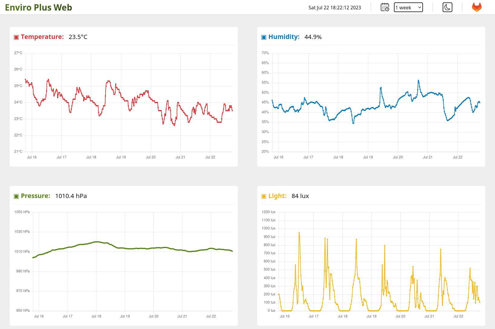
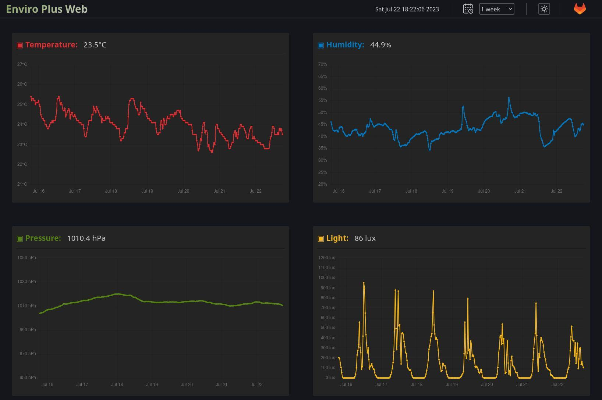

# 🌿 Enviro Plus Web

Web interface for [Enviro](https://shop.pimoroni.com/products/enviro?variant=31155658489939) and [Enviro+](https://shop.pimoroni.com/products/enviro?variant=31155658457171) sensor board plugged into a Raspberry Pi.  
This simple webapp serves a page with the current sensor readings in a graph over a specified time period.  
Runs thanks to [Flask](https://flask.palletsprojects.com) and [Chart.js](https://www.chartjs.org/)





Forked from <https://github.com/nophead/EnviroPlusWeb>

⚠️ Enviro readings must not be relied upon for critical applications.

## 📖 User guide

### Install (tested on Raspberry Pi OS Bullseye and Bookworm)

To start with, open your terminal and install the necessary dependencies in your Raspberry Pi:

```terminal
sudo apt install python3-pip python3-cffi libportaudio2 python3-numpy python3-smbus python3-pil python3-setuptools python3-flask
```

After installation, enable i2c and SPI:

```terminal
sudo raspi-config nonint do_i2c 0
```

```terminal
sudo raspi-config nonint do_spi 0
```

Additionally if you are using a particule sensor [PMS5003](https://shop.pimoroni.com/products/pms5003-particulate-matter-sensor-with-cable?variant=29075640352851) you will need to perform the requiered configuration depending on your OS version:

- **Bookworm**:

  ```terminal
  sudo raspi-config nonint do_serial_cons 1
  ```

  ```terminal
  sudo raspi-config nonint do_serial_hw 0
  ```

  Also edit your config.txt file by typing:

  ```terminal
  sudo nano /boot/firmware/config.txt
  ```

  and add the following lines at the end of the file:

  ```terminal
  dtoverlay=pi3-miniuart-bt
  dtoverlay=adau7002-simple
  ```

- **Bullseye**:

  ```terminal
  sudo raspi-config nonint do_serial 1
  ```

  Also edit your config.txt file by typing:

  ```terminal
  sudo nano /boot/config.txt
  ```

  and add the following lines at the end of the file:

  ```terminal
  enable_uart=1
  dtoverlay=pi3-miniuart-bt
  dtoverlay=adau7002-simple
  ```

Reboot your Raspberry Pi to apply these changes.

Now it's time to install the Python libraries in the "enviroplusweb" virtual environment. For that, create a new one:

```terminal
python3 -m venv --system-site-packages $HOME/.virtualenvs/enviroplusweb
```

After creation, it has to be activated:

```terminal
source ~/.virtualenvs/enviroplusweb/bin/activate
```

And now the Enviro libraries can be installed:

```terminal
python3 -m pip install enviroplus
```

The system is ready to clone the project in your Raspberry Pi. To achieve this, type:

```terminal
git clone https://gitlab.com/idotj/enviroplusweb.git
```

All set, you can now run the app:

```terminal
cd enviroplusweb
```

```terminal
python enviroplusweb.py
```

Open your browser and type the IP address of your Raspberry Pi followed by port :8080, example: `http://192.168.1.142:8080`

### Setup

Check at the beginning of the file `enviroplusweb.py` the following lines and choose `True` or `False` depending on your config:

- If you prefer to keep the Enviro LCD screen off, edit this line:

  ```python
  lcd_screen = False
  ```

- If you don't have a fan plugged into your Raspberry Pi, edit this line:

  ```python
  fan_gpio = False
  ```

- If you need temperature scale based on Fahrenheit, edit this line:

  ```python
  temp_celsius = False
  ```

- If you don't need temperature and humidity compensation, edit this line:

  ```python
  temp_humi_compensation = False
  ```

- If you have an Enviro board without gas sensor, edit this line:

  ```python
  gas_sensor = False
  ```

- If you don't have a particulate sensor [PMS5003](https://shop.pimoroni.com/products/pms5003-particulate-matter-sensor-with-cable?variant=29075640352851) plugged, edit this line:

  ```python
  particulate_sensor = False
  ```

### Extra setup

Maybe you want to run Enviro Plus Web at boot, then just type in the terminal:

```terminal
crontab -e
```

Add a new entry at the bottom with `@reboot` to specify that you want to run the command every time you restart your Raspberry Pi. Remember to replace in the path your HOSTNAME (if your default hostname is not 'raspberrypi').

```terminal
@reboot /bin/bash -c 'source ~/.virtualenvs/enviroplusweb/bin/activate && sudo ~/.virtualenvs/enviroplusweb/bin/python /home/raspberrypi/enviroplusweb/enviroplusweb.py >> /home/raspberrypi/enviroplusweb/enviroplusweb.log 2>&1'
```

## 🚀 Improve me

Feel free to add your features and improvements.

## ⚖️ License

GNU Affero General Public License v3.0

## 💬 FAQ

- ### Where are my data readings saved?

  Depends on where you run `enviroplusweb.py`. By default your data will be stored in the same place where you have the application, in JSON format inside a folder called `/enviroplusweb-data`.  
  But if you run the app at bootup (for example, using the _crontab_) then your folder `/enviroplusweb-data` will be at `/home/raspberrypi` (if your default hostname is 'raspberrypi').

- ### How can I get my Raspberry Pi IP?

  Enter `hostname -I` in a Terminal window on your Raspberry Pi, then you will see the IPv4 and the IPv6.

- ### Graphs are empty, they don't draw any lines, but the live readings on the header are displayed

  You need to wait to have some data recorded in your Raspberry Pi. If you just run the app for first time, give it some time to save readings (~25min).

- ### The Enviro screen doesn't show any data

  If you just run the app for first time, it's normal. You must wait (~25min) until a file with the most recent readings is generated.

- ### I got an error related with 'adau7002' while running Enviroplusweb

  After initialising the application, a series of errors appears in the terminal, ending with the message:  
  `ValueError: No input device matching 'adau7002'`

  This error has a related [open thread](https://github.com/pimoroni/enviroplus-python/issues/11) and looks like it's due to the drivers that are responsible for running the microphone.  
  At the moment the quickest solution is to reboot your raspberry pi.

- ### Raspberry Pi is running other services at localhost

  You can change the port to avoid any conflict with other applications. In that case edit the file `enviroplusweb.py` and find at the end this line:

  ```python
  app.run(debug=False, host='0.0.0.0', port=8080, use_reloader=False)
  ```

  Just change the `port=8080` for another number (for example `4567`) and run again the app. Now you can access to your EnviroPlusWeb typing the ip address followed by `:4567`

- ### Enviro Plus Web is running but I can't connect to the web server through my browser

  If running your app, you can see in the terminal the following message:

  ```terminal
  * Serving Flask app 'enviroplusweb'
  * Debug mode: off
  Permission denied
  ```

  This problem may be due to `port=80` not being available to be used by the application and you have to use another port.

- ### I want to run my EnviroPlusWeb under HTTPS

  By default you use HTTP to connect to your Raspberry Pi through your browser, but some browsers will redirect automatically to HTTPS. If you prefer to have your project running under HTTPS here you have a tutorial explaning how to setup Flask with HTTPS:  
  <https://blog.miguelgrinberg.com/post/running-your-flask-application-over-https>

### Other answered questions

Check the [closed issues](https://gitlab.com/idotj/enviroplusweb/-/issues/?sort=created_date&state=closed&first_page_size=20), you might find your question there.  
If nothing matches with your problem, check the [open issues](https://gitlab.com/idotj/enviroplusweb/-/issues/?sort=created_date&state=opened&first_page_size=20) or feel free to create a new one.
